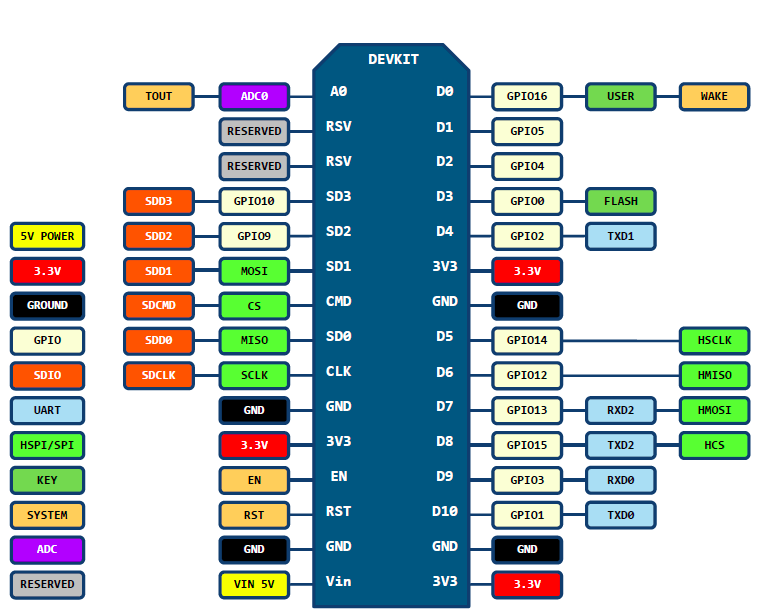

# esp8266

### 安装前的准备：刷microPython固件

首先使用git克隆我们的项目：

```
$ git clone https://github.com/OpensourceBooks/esp8266.git
```


进入项目目录：

```
$ cd esp8266
```

首先要安装pip，如果没有，你可以这样获得pip：

```
$ sudo python get-pip.py
```

接下来，安装esp8266芯片的刷机工具：

```
$ sudo pip install esptool
```

安装完毕后，把NodeMCU插到电脑的usb接口上，执行以下命令：

```
$ sudo esptool.py --port /dev/ttyUSB0 erase_flash
```

该命令用来清除esp8266中原厂固件。

如果找不到/dev/ttyUSB0，说明你的系统里缺少cp210x驱动（国内买到的NodeMCU基本上是cp210x驱动）。

安装 cp210x 驱动

```
cd /driver/linux
make
```

查看内核版本 kernel version

```
uname -a
```

让驱动生效

```
sudo cp cp210x.ko /lib/modules/4.9.0-6-amd64/kernel/drivers/usb/serial/
sudo insmod /lib/modules/4.9.0-6-amd64/kernel/drivers/usb/serial/usbserial.ko
sudo insmod cp210x.ko
sudo reboot
```

> 提示：替换 "4.9.0-6-amd64" 为你系统的内核。
> tips:replace "4.9.0-6-amd64" to your kernel version


如果你的电脑是mac系统，那么你需要安装SLAB_USBtoUART驱动程序，在本项目的drvier中可找到，双击安装即可。


对应的擦除命令如下：

```
$ sudo esptool.py --port /dev/tty.SLAB_USBtoUART erase_flash
```

即mac下的 /dev/tty.SLAB_USBtoUART 是linux下的 /dev/ttyUSB0 

之后所有mac的操作，用/dev/tty.SLAB_USBtoUART 代替 /dev/ttyUSB0 即可。

烧录

```
$ sudo esptool.py --port /dev/ttyUSB0 --baud 460800 write_flash --flash_size=detect 0 esp8266-20180511-v1.9.4.bin
```

mac烧录

```
$ sudo esptool.py --port /dev/tty.SLAB_USBtoUART --baud 460800 write_flash --flash_size=detect 0 esp8266-20180511-v1.9.4.bin
```

### 在esp8266中部署代码

刷了microPython固件后，esp8266就可以支持python语法了。接下来需要把硬件钱包的代码传过去。首先打开串口，如果你没有安装过，需要安装picocom。

archlinux：

```
$ sudo pacman -S picocom
```

mac:

```
brew install picocom
```

Ubuntu:

```
$ sudo apt install picocom
```

安装完picocom后，即可使用串口来调试esp8266：

```
$ sudo picocom /dev/ttyUSB0 -b115200
```

mac调试命令：

```
sudo picocom /dev/tty.SLAB_USBtoUART -b115200
```

调试命令仅仅是启动了一个microPython的串口控制台，传文件需要使用open函数，极其不方便。因此我们使用一个在线工具可以直接上传文件到esp8266：

http://micropython.org/webrepl/

为了使用webrepl，必须先在esp8266中开启webrepl服务。

现在开始设置webrepl：

```
>>> import webrepl_setup
```

该命令执行后会提示你设置密码

```
WebREPL daemon auto-start status: disabled
Would you like to (E)nable or (D)isable it running on boot?
(Empty line to quit)
> E
To enable WebREPL, you must set password for it
New password (4-9 chars): xxxxxx
Confirm password: xxxxxx
Changes will be activated after reboot
Would you like to reboot now? (y/n) y
```

输入后，就可以开启webrepl服务，即可以通过http://micropython.org/webrepl/连接esp8266来把我们的代码传上去。

为了连接webrepl服务，必须保证电脑加入esp8266的wifi中。这个时候，我们需要设置一个热点：

在终端界面下（串口），依次输入如下命令：

(>>>是microPython的控制台提示符，无需输入)

```
>>> import network
```

```
>>> ap = network.WLAN(network.AP_IF)
```

```
>>> ap.active(True)
```

```
>>> ap.config(essid="OpensourceBooks")
```

```
>>> ap.config(password="12345678")
```

这样，我们就建立了一个名称是OpensourceBooks密码是12345678的热点。接下来，先打开 http://micropython.org/webrepl/ ，然后用电脑连接这个热点，在webrepl的界面中，点击connect，输入之前设置的webrepl服务密码，即可连接到esp8266的webrepl服务。

在界面中，选择上传文件，把本项目中的main.py文件上传上去，重新启动后，即可使用了。

也可以使用图形界面工具 https://github.com/BetaRavener/uPyLoader/ 向esp8266中传文件。但是这个图形界面，需要安装pyqt5。

```
sudo apt-get install python3-pyqt5
```

### 附录：12864 oled pin参数

| 分辨率 | 128x64  |
| ------ | ------- |
| 电压   | 3.3V-5V |
| 协议   | IIC/SPI |

### 针脚连接

| NodeMCU      | OLED 显示屏 (SPI)                     |
| ------------ | ------------------------------------- |
| 3.3V         | VCC  电源（2.8V~5.5V）                |
| GND          | GND 接地 ()                           |
| D5 (GPIO 14) | SCK/D0 在 SPI 和 IIC 通信中为时钟管脚 |
| D7 (GPIO 13) | SDA/D1 在 SPI 和 IIC 通信中为数据管脚 |
| D2 (GPIO 4)  | RES 复位（低电平复位）                |
| D1 (GPIO 5)  | DC 数据和命令控制管脚                 |
| D0 (GPIO 16) | CS 片选管脚                           |

### esp8266 针脚图



#### 示例效果图


### 源码

https://github.com/OpensourceBooks/esp8266/blob/master/bth_weather/main.py
